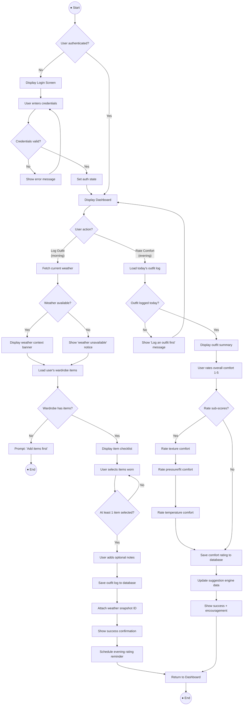
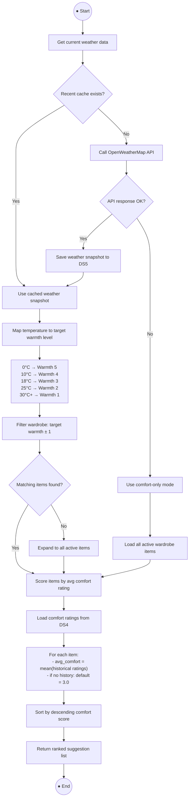

# Activity Diagram — Sensory Wardrobe

> **Bruce Schulz** | CIS248 Advanced App Development | Summer 2026

---

## Activity Diagram: Daily Outfit Logging & Comfort Rating Flow

### Narrative

This activity diagram illustrates the primary user workflow for the Sensory Wardrobe app: the daily process of logging an outfit and rating post-wear comfort. This flow is central to the app's value proposition — it captures the data that powers smart suggestions over time.

The user begins by opening the app (triggered by a morning push notification or voluntarily). The system checks authentication, then presents the outfit logging screen with the user's wardrobe items and current weather context. The user selects items worn, saves the log, and later returns (prompted by an evening notification) to rate their comfort. The rating feeds back into the suggestion engine for future recommendations.

### Diagram

---

## Swimlane Breakdown

| Lane | Actor | Responsibilities |
|------|-------|-----------------|
| User | Sensory-Sensitive User / Caregiver | Selects items, provides comfort scores, reads suggestions |
| App (Presentation) | Flutter UI Layer | Displays screens, validates input, shows feedback |
| App (Business Logic) | Providers & Services | Fetches weather, saves logs, calculates suggestions |
| External | OpenWeatherMap API / Push Service | Provides weather data, delivers notification reminders |

---

## Key Decision Points

| Decision | Yes Path | No Path |
|----------|----------|---------|
| User authenticated? | Proceed to Dashboard | Redirect to Login |
| Weather available? | Show weather banner with conditions | Show notice, proceed without weather |
| Wardrobe has items? | Show item checklist | Prompt user to add items first |
| At least 1 item selected? | Enable save button | Keep save disabled |
| Outfit logged today? | Show rating screen | Prompt to log outfit first |
| Rate sub-scores? | Show texture/pressure/temp sliders | Skip to save |

---

## Activity Diagram 2: Suggestion Generation Process

### Narrative

This diagram shows the internal process the app follows when generating outfit suggestions. It runs automatically when the user opens the Suggestions screen or views the Dashboard suggestion card. The algorithm considers current weather conditions, maps them to appropriate warmth levels, filters the wardrobe catalog, and ranks items by historical comfort scores. This is a system-focused diagram showing the decision logic rather than user interaction.

### Diagram

---

## Process Summary

| Step | Input | Output | Data Store |
|------|-------|--------|-----------|
| Fetch Weather | User location | Weather snapshot | DS5 |
| Map Warmth | Temperature (°C) | Target warmth level (1–5) | — |
| Filter Wardrobe | Target warmth, user ID | Matching clothing items | DS2 |
| Score Items | Item IDs | Comfort scores per item | DS4 |
| Rank & Return | Scored items | Ordered suggestion list | — |

---

*Activity diagrams created using Mermaid syntax. Render in any Mermaid-compatible viewer (GitHub, LucidChart import, VS Code Mermaid extension, or mermaid.live).*
