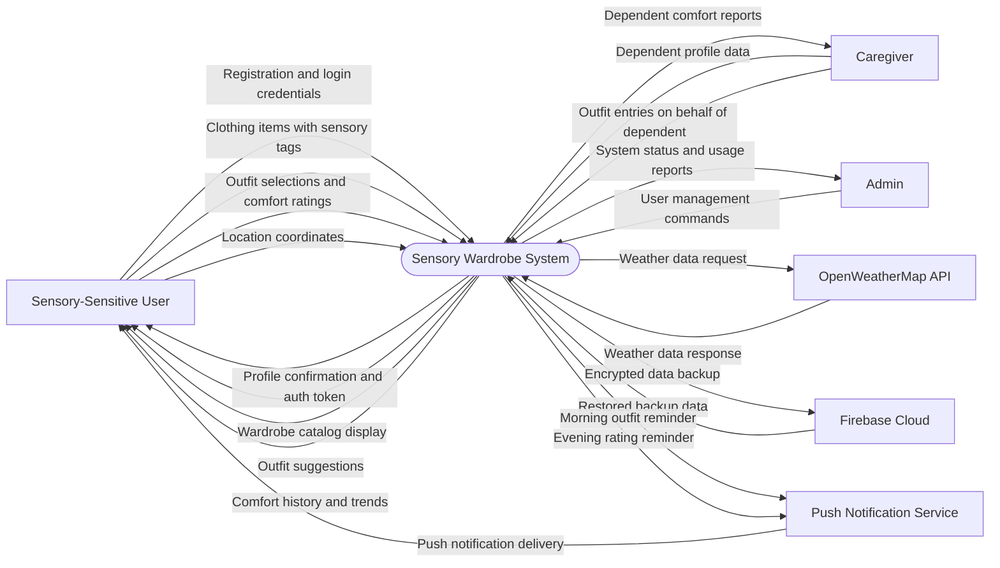
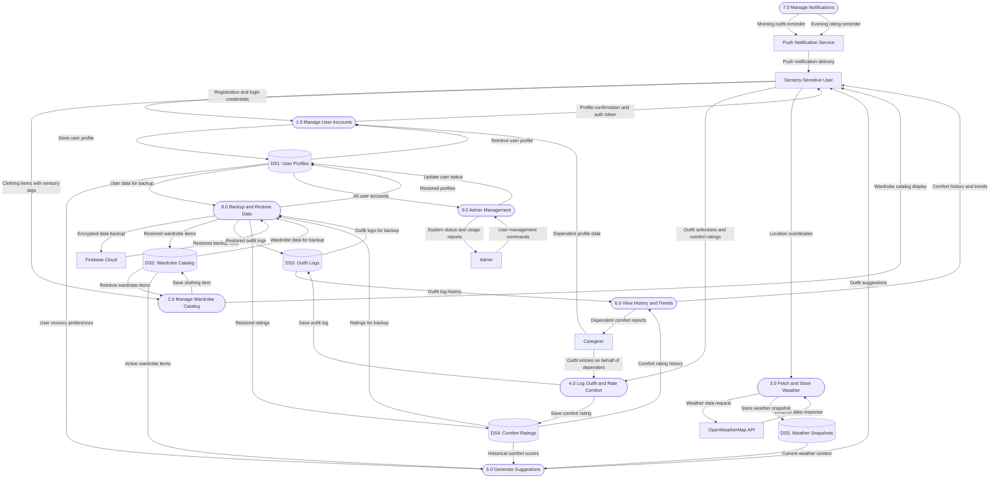

# Sensory Wardrobe — Balanced DFDs (Final)

> **Bruce Schulz** | CIS248 Advanced App Development | Summer 2026

---

## Balancing Notes

These two diagrams are **balanced**:
- External entities are labeled identically in both diagrams
- Every arrow in the Context Diagram appears exactly once in the Level 0 Diagram (same label, same direction, same external entity)
- Each arrow carries a single, clearly defined data flow

**External Entities (6):**
1. Sensory-Sensitive User
2. Caregiver
3. Admin
4. OpenWeatherMap API
5. Firebase Cloud
6. Push Notification Service

**Total Arrows: 20** (10 inbound, 10 outbound — identical in both diagrams)

---

# Part A: Context Diagram

## Narrative

The Context Diagram shows the Sensory Wardrobe system as a single process interacting with six external entities. Each arrow represents one distinct data flow. The system receives clothing data, comfort ratings, weather information, and administrative commands, then produces suggestions, history reports, reminders, and backups.

## Diagram

---

## Data Flow Table (Context)

| # | Flow Name | Direction | Source | Destination |
|:---:|-----------|:---------:|--------|-------------|
| 1 | Registration and login credentials | Inbound | Sensory-Sensitive User | System |
| 2 | Clothing items with sensory tags | Inbound | Sensory-Sensitive User | System |
| 3 | Outfit selections and comfort ratings | Inbound | Sensory-Sensitive User | System |
| 4 | Location coordinates | Inbound | Sensory-Sensitive User | System |
| 5 | Dependent profile data | Inbound | Caregiver | System |
| 6 | Outfit entries on behalf of dependent | Inbound | Caregiver | System |
| 7 | User management commands | Inbound | Admin | System |
| 8 | Weather data response | Inbound | OpenWeatherMap API | System |
| 9 | Restored backup data | Inbound | Firebase Cloud | System |
| 10 | Profile confirmation and auth token | Outbound | System | Sensory-Sensitive User |
| 11 | Wardrobe catalog display | Outbound | System | Sensory-Sensitive User |
| 12 | Outfit suggestions | Outbound | System | Sensory-Sensitive User |
| 13 | Comfort history and trends | Outbound | System | Sensory-Sensitive User |
| 14 | Dependent comfort reports | Outbound | System | Caregiver |
| 15 | System status and usage reports | Outbound | System | Admin |
| 16 | Weather data request | Outbound | System | OpenWeatherMap API |
| 17 | Encrypted data backup | Outbound | System | Firebase Cloud |
| 18 | Morning outfit reminder | Outbound | System | Push Notification Service |
| 19 | Evening rating reminder | Outbound | System | Push Notification Service |
| 20 | Push notification delivery | Outbound | Push Notification Service | Sensory-Sensitive User |

---

# Part B: Level 0 DFD

## Narrative

The Level 0 DFD decomposes the Sensory Wardrobe system into nine processes and five data stores. Every arrow from the Context Diagram appears here with the **exact same label**, now connected to the specific process that handles it. Internal flows between processes and data stores are also shown.

## Diagram

---

## Balancing Verification Checklist

| Arrow # | Label | Context: Source to Dest | Level 0: Source to Dest | Matched |
|:---:|---|---|---|:---:|
| 1 | Registration and login credentials | User → System | User → P1 | ✓ |
| 2 | Clothing items with sensory tags | User → System | User → P2 | ✓ |
| 3 | Outfit selections and comfort ratings | User → System | User → P4 | ✓ |
| 4 | Location coordinates | User → System | User → P3 | ✓ |
| 5 | Dependent profile data | Caregiver → System | Caregiver → P1 | ✓ |
| 6 | Outfit entries on behalf of dependent | Caregiver → System | Caregiver → P4 | ✓ |
| 7 | User management commands | Admin → System | Admin → P9 | ✓ |
| 8 | Weather data response | OpenWeatherMap API → System | OpenWeatherMap API → P3 | ✓ |
| 9 | Restored backup data | Firebase Cloud → System | Firebase Cloud → P8 | ✓ |
| 10 | Profile confirmation and auth token | System → User | P1 → User | ✓ |
| 11 | Wardrobe catalog display | System → User | P2 → User | ✓ |
| 12 | Outfit suggestions | System → User | P5 → User | ✓ |
| 13 | Comfort history and trends | System → User | P6 → User | ✓ |
| 14 | Dependent comfort reports | System → Caregiver | P6 → Caregiver | ✓ |
| 15 | System status and usage reports | System → Admin | P9 → Admin | ✓ |
| 16 | Weather data request | System → OpenWeatherMap API | P3 → OpenWeatherMap API | ✓ |
| 17 | Encrypted data backup | System → Firebase Cloud | P8 → Firebase Cloud | ✓ |
| 18 | Morning outfit reminder | System → Push Notification Service | P7 → Push Notification Service | ✓ |
| 19 | Evening rating reminder | System → Push Notification Service | P7 → Push Notification Service | ✓ |
| 20 | Push notification delivery | Push Notification Service → User | Push Notification Service → User | ✓ |

**Result: All 20 arrows balanced. All 6 external entities matched.**

---

## External Entities

| Entity | Role |
|--------|------|
| Sensory-Sensitive User | Primary user who manages wardrobe, logs outfits, rates comfort, receives suggestions |
| Caregiver | Manages profiles and outfit entries on behalf of a dependent user |
| Admin | Manages user accounts and system configuration |
| OpenWeatherMap API | External weather service providing real-time conditions |
| Firebase Cloud | Cloud storage for encrypted backups and restore |
| Push Notification Service | Delivers scheduled reminders to user devices |

## Data Stores

| ID | Store | Contents |
|---|-------|----------|
| DS1 | User Profiles | Account credentials, sensory preferences, roles, caregiver links |
| DS2 | Wardrobe Catalog | Clothing items with sensory tags, photos, warmth levels |
| DS3 | Outfit Logs | Daily outfit selections with weather context |
| DS4 | Comfort Ratings | Post-wear comfort scores (overall plus sub-scores) |
| DS5 | Weather Snapshots | Cached weather data (temperature, humidity, conditions) |

---

*Both diagrams are balanced per DFD conventions: identical external entities, identical arrow count, and identical arrow labels between Context and Level 0.*
