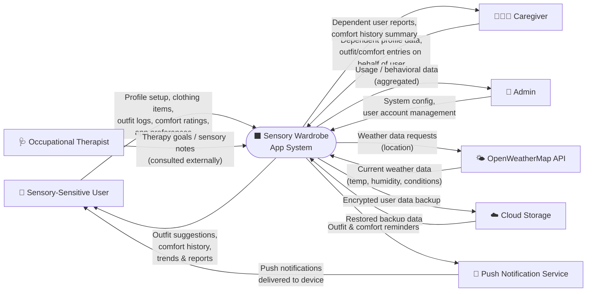

# Sensory Wardrobe — Context Diagram (DFD Level 0 / Context)

> **DRAFT** — Bruce Schulz | CIS248 Advanced App Development | Summer 2026

---

## Diagram

---

## External Entities

| Entity | Role |
|---|---|
| Sensory-Sensitive User | Primary end-user; logs clothing, rates comfort, receives suggestions |
| Caregiver | Manages profiles and entries on behalf of a dependent user |
| Occupational Therapist | Provides context/goals that inform how the app is used (indirect stakeholder) |
| Admin | Manages system configuration and user accounts |
| OpenWeatherMap API | Provides real-time weather data based on user location |
| Cloud Storage | Stores and restores encrypted user data backups |
| Push Notification Service | Delivers reminders and outfit suggestions to user devices |

---

## Key Data Flows

| Flow | Direction | Description |
|---|---|---|
| Profile & wardrobe data | User → System | Account info, clothing catalog, sensory tags |
| Comfort ratings & outfit logs | User → System | Daily outfit selections and post-wear comfort scores |
| Weather request / response | System ↔ OpenWeatherMap | Location sent; current conditions returned |
| Outfit suggestions | System → User | Recommendations based on weather + comfort history |
| Backup / restore | System ↔ Cloud Storage | Encrypted data sent/retrieved |
| Push notifications | System → Notification Service → User | Reminders for logging outfits and comfort ratings |
| Admin oversight | Admin → System / System → Admin | Config inputs and aggregated usage data |

---

*This is a DRAFT. Data flows and external entities subject to revision.*
