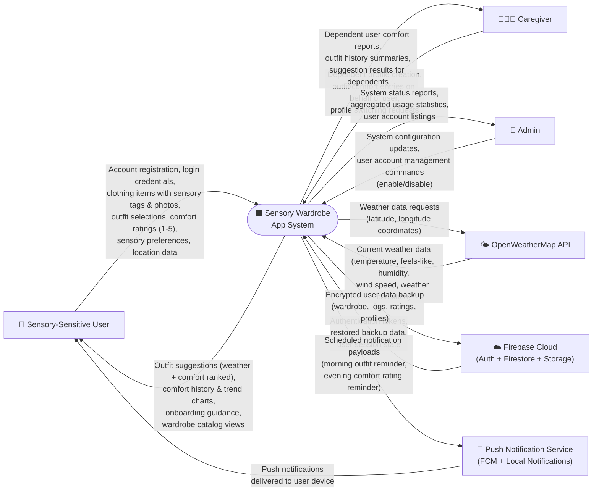

# Sensory Wardrobe — Context Diagram (Final)

> **Bruce Schulz** | CIS248 Advanced App Development | Summer 2026

---

## Narrative

The Context Diagram represents the highest level of abstraction for the Sensory Wardrobe system. It shows the system as a single process interacting with all external entities. The Sensory Wardrobe App System receives input from users (sensory-sensitive individuals and their caregivers), an administrator, the OpenWeatherMap API, and Cloud Storage. It produces outfit suggestions, comfort reports, reminders, and encrypted backups as outputs.

The system's primary value is connecting sensory preference data with weather conditions to generate personalized, comfort-optimized clothing recommendations that improve over time as users provide feedback.

---

## Diagram

---

## External Entities

| Entity | Role | Data Exchanged |
|--------|------|----------------|
| Sensory-Sensitive User | Primary end-user; manages wardrobe, logs outfits, rates comfort, receives suggestions | Profile data, clothing items, outfit logs, comfort scores, preferences |
| Caregiver | Manages profiles and entries on behalf of a dependent (e.g., child with autism) | Dependent profiles, proxy outfit/comfort entries, reports |
| Admin | Maintains system configuration and manages user accounts | Config settings, account enable/disable, usage reports |
| OpenWeatherMap API | External weather service providing real-time meteorological data | Location coordinates (out) → temperature, humidity, conditions (in) |
| Firebase Cloud | Provides authentication, cloud database, and file storage services | Auth tokens, encrypted backups, session state |
| Push Notification Service | Delivers timed reminders to user devices | Notification payloads (out) → device delivery confirmation (in) |

---

## System Boundary

Everything inside the "Sensory Wardrobe App System" box includes:
- User account and profile management (P1.0)
- Wardrobe catalog with sensory attributes (P2.0)
- Weather data fetching and caching (P3.0)
- Outfit logging and comfort rating capture (P4.0)
- Smart suggestion engine (P5.0)
- History and trend analysis (P6.0)
- Notification scheduling (P7.0)
- Encrypted backup and restore (P8.0)
- Admin system management (P9.0)

---

## Data Flow Summary

| # | Flow Name | Source → Destination | Description |
|---|-----------|---------------------|-------------|
| 1 | User Registration & Login | User → System | Account creation and authentication credentials |
| 2 | Wardrobe Data Entry | User → System | Clothing items with name, category, sensory tags, photos, warmth level |
| 3 | Outfit Log Submission | User → System | Selected items for today's outfit with optional notes |
| 4 | Comfort Rating | User → System | Overall score (1–5) plus optional texture/pressure/temperature sub-scores |
| 5 | Weather Request | System → OpenWeatherMap | GPS coordinates sent to retrieve current conditions |
| 6 | Weather Response | OpenWeatherMap → System | Temperature, feels-like, humidity, wind, condition code |
| 7 | Outfit Suggestions | System → User | Ranked clothing recommendations based on weather + comfort history |
| 8 | Comfort Trends | System → User | Historical charts and pattern insights |
| 9 | Backup Data | System → Firebase Cloud | AES-encrypted bundle of all user data |
| 10 | Restore Data | Firebase Cloud → System | Decrypted and imported user data on new device |
| 11 | Notification Schedule | System → Push Service | Timed reminder payloads for morning/evening |
| 12 | Admin Commands | Admin → System | Account management and configuration changes |

---

*This is the FINAL version of the Context Diagram, incorporating all system features identified during Sprint 1.*
