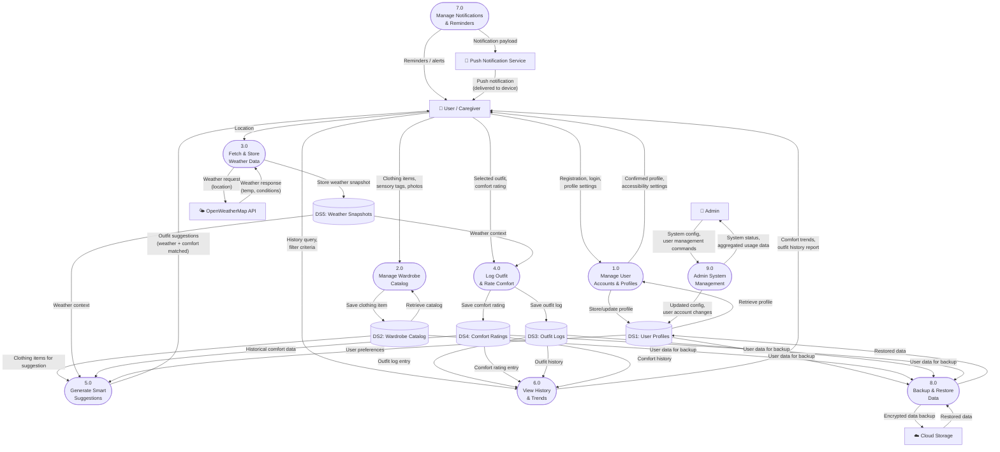

# Sensory Wardrobe — Level 0 DFD (Major Processes)

> **DRAFT** — Bruce Schulz | CIS248 Advanced App Development | Summer 2026

---

## Diagram

---

## Processes

| # | Process | Description |
|---|---|---|
| 1.0 | Manage User Accounts & Profiles | Registration, login, multi-profile support, accessibility preferences |
| 2.0 | Manage Wardrobe Catalog | Add, edit, delete clothing items; attach sensory tags and photos |
| 3.0 | Fetch & Store Weather Data | Call OpenWeatherMap API with user location; cache weather snapshots |
| 4.0 | Log Outfit & Rate Comfort | Record daily outfit selection, attach weather context, capture post-wear comfort score |
| 5.0 | Generate Smart Suggestions | Analyze weather + comfort history + wardrobe catalog to recommend outfits |
| 6.0 | View History & Trends | Display outfit logs, comfort trends, and pattern summaries |
| 7.0 | Manage Notifications & Reminders | Schedule and send outfit/logging reminders via push notification service |
| 8.0 | Backup & Restore Data | Encrypt and sync user data to cloud; restore on new device or app reinstall |
| 9.0 | Admin System Management | Manage user accounts, system configuration, and monitor usage |

---

## Data Stores

| ID | Store | Contents |
|---|---|---|
| DS1 | User Profiles | Account credentials, preferences, accessibility settings, multi-profile links |
| DS2 | Wardrobe Catalog | Clothing items, sensory tags, photos, categories |
| DS3 | Outfit Logs | Date, selected items, linked weather snapshot |
| DS4 | Comfort Ratings | Post-wear comfort scores linked to outfit logs |
| DS5 | Weather Snapshots | Cached weather data (temp, humidity, conditions) tied to a date/location |

---

*This is a DRAFT. Processes, data stores, and flows subject to revision.*
