# Sensory Wardrobe — Level 0 DFD (Final)

> **Bruce Schulz** | CIS248 Advanced App Development | Summer 2026

---

## Narrative

The Level 0 Data Flow Diagram decomposes the Sensory Wardrobe system into its nine major processes, five data stores, and all data flows between them. Each process represents a distinct functional area of the application. Data stores represent persistent storage (SQLite tables locally, Firebase in the cloud). External entities interact with specific processes based on their role.

This diagram shows how user input (clothing items, outfit selections, comfort ratings) flows through the system, gets stored, and feeds into the suggestion engine that produces personalized outfit recommendations. The feedback loop — where comfort ratings improve future suggestions — is the core value mechanism of the application.

---

## Diagram

```mermaid
graph TD
    %% ── External Entities ──────────────────────────────────────────
    U["👤 User / Caregiver"]
    ADM["🔐 Admin"]
    WX["🌤️ OpenWeatherMap API"]
    CLOUD["☁️ Firebase Cloud"]
    NOTIF["🔔 Push Notification Service"]

    %% ── Data Stores ─────────────────────────────────────────────────
    DS1[("DS1: User Profiles\n(user_profiles table)")]
    DS2[("DS2: Wardrobe Catalog\n(wardrobe_items table)")]
    DS3[("DS3: Outfit Logs\n(outfit_logs table)")]
    DS4[("DS4: Comfort Ratings\n(comfort_ratings table)")]
    DS5[("DS5: Weather Snapshots\n(weather_snapshots table)")]

    %% ── Processes ────────────────────────────────────────────────────
    P1(["1.0\nManage User\nAccounts & Profiles"])
    P2(["2.0\nManage Wardrobe\nCatalog"])
    P3(["3.0\nFetch & Store\nWeather Data"])
    P4(["4.0\nLog Outfit\n& Rate Comfort"])
    P5(["5.0\nGenerate Smart\nSuggestions"])
    P6(["6.0\nView History\n& Trends"])
    P7(["7.0\nManage Notifications\n& Reminders"])
    P8(["8.0\nBackup & Restore\nData"])
    P9(["9.0\nAdmin System\nManagement"])

    %% ── User / Caregiver → Processes ────────────────────────────────
    U -- "Registration data, login credentials,\nprofile settings, sensory preferences" --> P1
    U -- "Clothing items: name, category,\nfabric, sensory tags, warmth level, photo" --> P2
    U -- "Selected outfit items,\ncomfort scores (overall + sub-scores),\noptional notes" --> P4
    U -- "Date range, category filter,\nhistory query" --> P6
    U -- "GPS location coordinates" --> P3
    U -- "Notification preferences\n(times, enable/disable)" --> P7

    %% ── Processes → User ────────────────────────────────────────────
    P1 -- "Confirmed profile,\naccessibility settings,\ndependent profile list" --> U
    P2 -- "Wardrobe item list\n(filtered/sorted)" --> U
    P5 -- "Ranked outfit suggestions\n(weather + comfort matched)" --> U
    P6 -- "Comfort trend charts,\noutfit history list,\ncategory insights" --> U
    P7 -- "Morning/evening reminders\nvia push notification" --> U

    %% ── Process 1: Account Management ──────────────────────────────
    P1 -- "Create/update user profile\n(id, name, email, sensory_prefs,\nrole, caregiver_id)" --> DS1
    DS1 -- "Retrieve user profile\nfor authentication & display" --> P1

    %% ── Process 2: Wardrobe Catalog ─────────────────────────────────
    P2 -- "Insert/update clothing item\n(sensory tags, warmth, photo_path)" --> DS2
    DS2 -- "Retrieve wardrobe items\n(by user, category, tags)" --> P2
    DS2 -- "Active clothing items\nwith sensory attributes" --> P5

    %% ── Process 3: Weather ───────────────────────────────────────────
    P3 -- "HTTP GET request\n(lat, lon, API key)" --> WX
    WX -- "JSON response: temp_c,\nfeels_like_c, humidity,\ncondition, wind_speed" --> P3
    P3 -- "Save weather snapshot\n(location, conditions, timestamp)" --> DS5
    DS5 -- "Current/cached weather\nfor suggestion context" --> P5
    DS5 -- "Weather at time of outfit\nfor log association" --> P4

    %% ── Process 4: Outfit Logging & Rating ──────────────────────────
    P4 -- "Save outfit log\n(user_id, date, item_ids,\nweather_snapshot_id, notes)" --> DS3
    P4 -- "Save comfort rating\n(overall_score, texture_score,\npressure_score, temp_score)" --> DS4
    DS3 -- "Today's outfit log\n(for rating association)" --> P4
    DS4 -- "Historical comfort scores\nper item (for ranking)" --> P5

    %% ── Process 5: Smart Suggestions ────────────────────────────────
    DS1 -- "User sensory preferences\n(texture sensitivity, warmth pref)" --> P5

    %% ── Process 6: History & Trends ─────────────────────────────────
    DS3 -- "Outfit log entries\n(date, items, weather)" --> P6
    DS4 -- "Comfort ratings over time\n(scores, timestamps)" --> P6
    DS2 -- "Item details for\nhistory display" --> P6
    DS5 -- "Weather context\nfor historical entries" --> P6

    %% ── Process 7: Notifications ─────────────────────────────────────
    P7 -- "Scheduled notification\n(title, body, time, payload)" --> NOTIF
    NOTIF -- "Delivery confirmation /\nuser tap action" --> P7

    %% ── Process 8: Backup & Restore ─────────────────────────────────
    DS1 -- "All user profiles" --> P8
    DS2 -- "All wardrobe items" --> P8
    DS3 -- "All outfit logs" --> P8
    DS4 -- "All comfort ratings" --> P8
    DS5 -- "All weather snapshots" --> P8
    P8 -- "AES-encrypted data bundle" --> CLOUD
    CLOUD -- "Encrypted backup data\n(for restore)" --> P8
    P8 -- "Restored records\n(decrypted & imported)" --> DS1
    P8 -- "Restored wardrobe items" --> DS2
    P8 -- "Restored outfit logs" --> DS3
    P8 -- "Restored comfort ratings" --> DS4

    %% ── Process 9: Admin ─────────────────────────────────────────────
    ADM -- "System config updates,\nuser enable/disable commands,\nrole assignments" --> P9
    P9 -- "Update user role/status\n(is_disabled, role fields)" --> DS1
    P9 -- "System status report,\nuser count, aggregated\nusage statistics" --> ADM
    DS1 -- "All user accounts\n(for admin listing)" --> P9
```

---

## Processes

| # | Process | Description | Key Inputs | Key Outputs |
|---|---------|-------------|-----------|-------------|
| 1.0 | Manage User Accounts & Profiles | Handles registration, login, multi-profile (caregiver/dependent), and sensory preference management | Credentials, profile data, sensory preferences | Authenticated session, profile confirmations |
| 2.0 | Manage Wardrobe Catalog | CRUD operations for clothing items including sensory tag assignment, photo attachment, and categorization | Item name, category, tags, warmth level, photo | Filtered/sorted item lists |
| 3.0 | Fetch & Store Weather Data | Calls OpenWeatherMap API with user GPS coordinates, caches results in DS5 for reuse | Location (lat/lon) | Weather snapshot (temp, humidity, conditions) |
| 4.0 | Log Outfit & Rate Comfort | Records daily outfit selections with weather context; captures post-wear comfort scores | Selected items, comfort scores | Saved outfit log, saved rating |
| 5.0 | Generate Smart Suggestions | Combines weather → warmth mapping + wardrobe filtering + comfort history scoring to rank outfit recommendations | Weather, wardrobe items, comfort history, preferences | Ranked suggestion list |
| 6.0 | View History & Trends | Retrieves and displays past outfit logs with comfort scores; computes trend charts and category insights | Date filters, category filters | History list, trend charts, insights |
| 7.0 | Manage Notifications & Reminders | Schedules timezone-aware local notifications for morning outfit logging and evening comfort rating | User time preferences, enable/disable flags | Push notification payloads |
| 8.0 | Backup & Restore Data | Encrypts all user data (AES) and syncs to Firebase Cloud Storage; restores on demand | All data stores | Encrypted backup / restored data |
| 9.0 | Admin System Management | Provides admin-only functionality for user account management, role assignment, and system configuration | Admin commands | Updated user states, status reports |

---

## Data Stores

| ID | Store | SQLite Table | Key Columns | Used By Processes |
|---|-------|-------------|-------------|-------------------|
| DS1 | User Profiles | `user_profiles` | id, display_name, email, is_dependent, caregiver_id, sensory_preferences, role, is_disabled | P1, P5, P8, P9 |
| DS2 | Wardrobe Catalog | `wardrobe_items` | id, user_id, name, category, fabric, sensory_tags (JSON), warmth_level, photo_path, is_active | P2, P5, P6, P8 |
| DS3 | Outfit Logs | `outfit_logs` | id, user_id, logged_date, item_ids (JSON), weather_snapshot_id, notes | P4, P6, P8 |
| DS4 | Comfort Ratings | `comfort_ratings` | id, outfit_log_id, user_id, overall_score, texture_score, pressure_score, temperature_score | P4, P5, P6, P8 |
| DS5 | Weather Snapshots | `weather_snapshots` | id, location_lat, location_lon, temperature_c, feels_like_c, humidity, condition, fetched_at | P3, P4, P5, P6, P8 |

---

## Data Flow Catalog

| Flow # | From | To | Data Description |
|:---:|------|-----|-----------------|
| 1 | User | P1 | Registration credentials, profile settings |
| 2 | P1 | DS1 | New/updated user profile record |
| 3 | DS1 | P1 | Retrieved profile for login validation |
| 4 | P1 | User | Profile confirmation, auth token |
| 5 | User | P2 | Clothing item data (name, tags, photo) |
| 6 | P2 | DS2 | Saved clothing item record |
| 7 | DS2 | P2 | Retrieved wardrobe items (filtered) |
| 8 | P2 | User | Wardrobe list display data |
| 9 | User | P3 | GPS coordinates (lat, lon) |
| 10 | P3 | WX | API request (location + key) |
| 11 | WX | P3 | Weather JSON response |
| 12 | P3 | DS5 | Cached weather snapshot |
| 13 | User | P4 | Selected outfit items + comfort scores |
| 14 | P4 | DS3 | Outfit log record |
| 15 | P4 | DS4 | Comfort rating record |
| 16 | DS2 | P5 | Active wardrobe items for matching |
| 17 | DS4 | P5 | Historical comfort averages per item |
| 18 | DS5 | P5 | Current weather for warmth mapping |
| 19 | DS1 | P5 | User sensory preferences |
| 20 | P5 | User | Ranked suggestion list |
| 21 | DS3 | P6 | Outfit log history |
| 22 | DS4 | P6 | Comfort scores for trend charts |
| 23 | P6 | User | History list + trend visualizations |
| 24 | P7 | NOTIF | Notification payload (scheduled) |
| 25 | NOTIF | User | Push notification delivery |
| 26 | DS1–DS5 | P8 | All user data for backup |
| 27 | P8 | CLOUD | Encrypted backup bundle |
| 28 | CLOUD | P8 | Encrypted data for restore |
| 29 | ADM | P9 | Admin commands |
| 30 | P9 | DS1 | Updated user roles/status |
| 31 | P9 | ADM | System reports |

---

*This is the FINAL version of the Level 0 DFD, reflecting the complete system design implemented during Sprint 1.*
