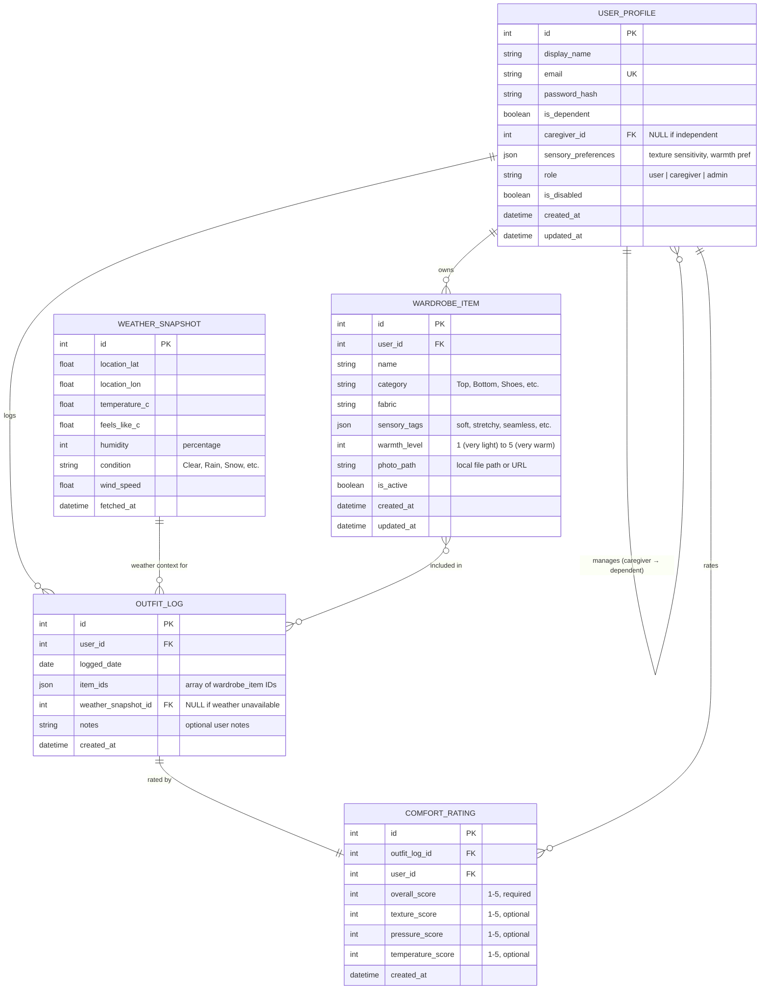

# Sensory Wardrobe — Entity-Relationship Diagram (DRAFT)

> **Bruce Schulz** | CIS248 Advanced App Development | Summer 2026

---

## Narrative

This ERD represents the logical data model for the Sensory Wardrobe application. It maps directly to the five SQLite data stores (DS1–DS5) identified in the Level 0 DFD and includes the relationships between entities that drive the suggestion engine, outfit logging, and multi-profile management features.

The central feedback loop — where users log outfits, rate comfort, and receive improved suggestions — is reflected in the relationships between `WardrobeItem`, `OutfitLog`, `ComfortRating`, and `WeatherSnapshot`.

---

## ER Diagram

---

## Entity Descriptions

| Entity | DFD Store | Purpose |
|--------|-----------|---------|
| USER_PROFILE | DS1 | Stores user accounts including caregivers, dependents, and admins. The self-referencing `caregiver_id` enables the multi-profile feature. |
| WARDROBE_ITEM | DS2 | Clothing catalog entries with sensory attributes. Each item belongs to one user and is tagged with sensory properties and a warmth level used by the suggestion engine. |
| OUTFIT_LOG | DS3 | Records a daily outfit selection. Links to the user, weather context at time of wear, and the specific wardrobe items chosen (stored as JSON array of IDs). |
| COMFORT_RATING | DS4 | Post-wear comfort feedback tied to an outfit log. The overall score is required; sub-scores (texture, pressure, temperature) are optional. These scores feed the suggestion engine's ranking algorithm. |
| WEATHER_SNAPSHOT | DS5 | Cached weather data from OpenWeatherMap API. Linked to outfit logs to provide environmental context and used by the suggestion engine for warmth-level matching. |

---

## Relationship Summary

| Relationship | Cardinality | Description |
|:---|:---:|:---|
| USER_PROFILE → USER_PROFILE | 1:M (self) | A caregiver manages zero or more dependent profiles |
| USER_PROFILE → WARDROBE_ITEM | 1:M | A user owns zero or more clothing items |
| USER_PROFILE → OUTFIT_LOG | 1:M | A user creates zero or more daily outfit logs |
| USER_PROFILE → COMFORT_RATING | 1:M | A user provides zero or more comfort ratings |
| OUTFIT_LOG → COMFORT_RATING | 1:1 | Each outfit log has exactly one associated comfort rating |
| WEATHER_SNAPSHOT → OUTFIT_LOG | 1:M | One weather snapshot can be referenced by multiple outfit logs (same day/location) |
| WARDROBE_ITEM ↔ OUTFIT_LOG | M:N | An outfit log contains multiple items; an item can appear in multiple logs (via `item_ids` JSON) |

---

## Design Notes & Assumptions

1. **Many-to-Many (Items ↔ Logs):** The current implementation stores `item_ids` as a JSON array inside `outfit_logs`. A normalized design would use a junction table (`outfit_log_items`), but the JSON approach was chosen for simplicity with SQLite and Flutter's data layer. This is noted as a potential normalization improvement.

2. **Self-Referencing Relationship:** The caregiver/dependent relationship is modeled as a self-referencing foreign key (`caregiver_id` → `user_profiles.id`). A dependent's `is_dependent = true` and their `caregiver_id` points to the managing caregiver's record.

3. **Comfort Rating Cardinality:** Each outfit log has exactly one comfort rating (1:1). The rating is created after the outfit is worn, typically in the evening when the notification reminder fires.

4. **Weather Snapshot Reuse:** Multiple outfit logs on the same day/location may reference the same cached weather snapshot, making this a 1:M relationship.

5. **Soft Delete Pattern:** `is_active` on wardrobe items and `is_disabled` on user profiles implement soft-delete behavior — records are never physically removed, preserving historical integrity for the suggestion engine.

6. **Role-Based Access:** The `role` field in USER_PROFILE (`user | caregiver | admin`) controls access to admin features (P9) and multi-profile management.

---

## Potential Normalization Improvements (for discussion)

- **Junction table for outfit items:** Replace `item_ids` JSON with an `OUTFIT_LOG_ITEMS` associative entity (outfit_log_id, wardrobe_item_id) for proper referential integrity.
- **Sensory tags normalization:** Replace `sensory_tags` JSON with a separate `SENSORY_TAG` entity and a many-to-many join table, enabling tag-based queries and analytics.
- **Notification preferences:** Could be extracted into a separate `NOTIFICATION_SETTINGS` entity rather than being embedded in user preferences.

---

*DRAFT — Submitted for instructor review. Will finalize based on feedback.*
