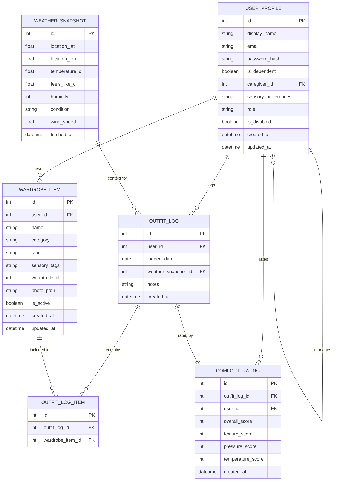

# Sensory Wardrobe — Entity-Relationship Diagram (FINAL)

> **Team:** Bruce Schulz, Zach Kahler,
> Nova Denton-Parry, Jeremy Kirkpatrick  
> **Course:** CIS248 Advanced App Development  
> Summer 2026 — **Deliverable 3**

---

## Narrative

This ERD represents the final logical data model for the
Sensory Wardrobe application. It maps directly to the five
SQLite data stores (DS1-DS5) identified in the Level 0 DFD.

Based on instructor feedback from the draft submission, this
version introduces a proper junction table (OUTFIT_LOG_ITEM)
to normalize the many-to-many relationship between outfit
logs and wardrobe items, replacing the previous JSON array
approach.

The central feedback loop — where users log outfits, rate
comfort, and receive improved suggestions — is reflected in
the relationships between WARDROBE_ITEM, OUTFIT_LOG,
COMFORT_RATING, and WEATHER_SNAPSHOT.

---

## ER Diagram



**Note:** The self-referencing relationship (USER_PROFILE
manages USER_PROFILE) may not render in all Mermaid versions.
See Relationship Summary below for documentation.

---

## Entity Descriptions

| Entity | Store | Purpose |
|--------|-------|---------|
| USER_PROFILE | DS1 | User accounts: caregivers, dependents, admins. Self-referencing caregiver_id enables multi-profile. |
| WARDROBE_ITEM | DS2 | Clothing catalog with sensory tags and warmth level (1-5) for suggestion engine. |
| OUTFIT_LOG | DS3 | Daily outfit selection linked to user, weather, and items via junction table. |
| OUTFIT_LOG_ITEM | DS3 | Junction table resolving M:N between logs and items. |
| COMFORT_RATING | DS4 | Post-wear comfort scores (overall required, sub-scores optional). Feeds suggestion ranking. |
| WEATHER_SNAPSHOT | DS5 | Cached weather from OpenWeatherMap. Provides context for outfit logs and suggestions. |

---

## Relationship Summary

| Relationship | Card. | FK Location |
|:---|:---:|:---|
| USER_PROFILE to USER_PROFILE | 1:M | caregiver_id in child |
| USER_PROFILE to WARDROBE_ITEM | 1:M | user_id in WARDROBE_ITEM |
| USER_PROFILE to OUTFIT_LOG | 1:M | user_id in OUTFIT_LOG |
| USER_PROFILE to COMFORT_RATING | 1:M | user_id in COMFORT_RATING |
| OUTFIT_LOG to COMFORT_RATING | 1:1 | outfit_log_id in COMFORT_RATING |
| OUTFIT_LOG to OUTFIT_LOG_ITEM | 1:M | outfit_log_id in junction |
| WARDROBE_ITEM to OUTFIT_LOG_ITEM | 1:M | wardrobe_item_id in junction |
| WEATHER_SNAPSHOT to OUTFIT_LOG | 1:M | weather_snapshot_id in OUTFIT_LOG |

---

## Attribute Details

### USER_PROFILE (DS1)

| Attribute | Type | Constraints |
|-----------|------|-------------|
| id | INTEGER | PK, AUTO_INCREMENT |
| display_name | TEXT | NOT NULL |
| email | TEXT | NOT NULL, UNIQUE |
| password_hash | TEXT | NOT NULL |
| is_dependent | BOOLEAN | NOT NULL, DEFAULT FALSE |
| caregiver_id | INTEGER | FK, NULLABLE |
| sensory_preferences | TEXT | NULLABLE (JSON) |
| role | TEXT | NOT NULL, DEFAULT 'user' |
| is_disabled | BOOLEAN | NOT NULL, DEFAULT FALSE |
| created_at | DATETIME | NOT NULL |
| updated_at | DATETIME | NOT NULL |

### WARDROBE_ITEM (DS2)

| Attribute | Type | Constraints |
|-----------|------|-------------|
| id | INTEGER | PK, AUTO_INCREMENT |
| user_id | INTEGER | FK, NOT NULL |
| name | TEXT | NOT NULL |
| category | TEXT | NOT NULL |
| fabric | TEXT | NULLABLE |
| sensory_tags | TEXT | NULLABLE (JSON array) |
| warmth_level | INTEGER | NOT NULL, CHECK 1-5 |
| photo_path | TEXT | NULLABLE |
| is_active | BOOLEAN | NOT NULL, DEFAULT TRUE |
| created_at | DATETIME | NOT NULL |
| updated_at | DATETIME | NOT NULL |

### OUTFIT_LOG (DS3)

| Attribute | Type | Constraints |
|-----------|------|-------------|
| id | INTEGER | PK, AUTO_INCREMENT |
| user_id | INTEGER | FK, NOT NULL |
| logged_date | DATE | NOT NULL |
| weather_snapshot_id | INTEGER | FK, NULLABLE |
| notes | TEXT | NULLABLE |
| created_at | DATETIME | NOT NULL |

### OUTFIT_LOG_ITEM (Junction)

| Attribute | Type | Constraints |
|-----------|------|-------------|
| id | INTEGER | PK, AUTO_INCREMENT |
| outfit_log_id | INTEGER | FK, NOT NULL |
| wardrobe_item_id | INTEGER | FK, NOT NULL |

Composite UNIQUE on (outfit_log_id, wardrobe_item_id).

### COMFORT_RATING (DS4)

| Attribute | Type | Constraints |
|-----------|------|-------------|
| id | INTEGER | PK, AUTO_INCREMENT |
| outfit_log_id | INTEGER | FK, NOT NULL, UNIQUE |
| user_id | INTEGER | FK, NOT NULL |
| overall_score | INTEGER | NOT NULL, CHECK 1-5 |
| texture_score | INTEGER | NULLABLE, CHECK 1-5 |
| pressure_score | INTEGER | NULLABLE, CHECK 1-5 |
| temperature_score | INTEGER | NULLABLE, CHECK 1-5 |
| created_at | DATETIME | NOT NULL |

### WEATHER_SNAPSHOT (DS5)

| Attribute | Type | Constraints |
|-----------|------|-------------|
| id | INTEGER | PK, AUTO_INCREMENT |
| location_lat | REAL | NOT NULL |
| location_lon | REAL | NOT NULL |
| temperature_c | REAL | NOT NULL |
| feels_like_c | REAL | NOT NULL |
| humidity | INTEGER | NOT NULL |
| condition | TEXT | NOT NULL |
| wind_speed | REAL | NULLABLE |
| fetched_at | DATETIME | NOT NULL |

---

## Design Decisions

1. **Normalized M:N Relationship:** OUTFIT_LOG_ITEM junction
   table replaces the item_ids JSON array. Provides referential
   integrity, enables JOINs for per-item analytics, and supports
   CASCADE deletes.

2. **Self-Referencing FK:** caregiver_id points back to
   USER_PROFILE.id. When is_dependent = TRUE, the record
   belongs to a dependent managed by the referenced caregiver.

3. **1:1 Comfort Rating:** Enforced via UNIQUE constraint on
   outfit_log_id. Each outfit is rated once after wearing.

4. **Weather Snapshot Reuse:** Snapshots cached independently.
   Multiple logs from same day/location share one snapshot,
   reducing storage and API calls.

5. **Soft Delete:** is_active (items) and is_disabled (users)
   preserve history. Inactive items excluded from suggestions
   but visible in past logs.

6. **Tags as JSON String:** Pragmatic choice for SQLite +
   Flutter. Predefined tag list enforced at application layer.

7. **Role-Based Access:** Three levels: user, caregiver, admin.
   Authorization enforced at router and repository layers.

---

## Schema SQL

```sql
CREATE TABLE user_profiles (
    id INTEGER PRIMARY KEY AUTOINCREMENT,
    display_name TEXT NOT NULL,
    email TEXT NOT NULL UNIQUE,
    password_hash TEXT NOT NULL,
    is_dependent INTEGER NOT NULL DEFAULT 0,
    caregiver_id INTEGER
        REFERENCES user_profiles(id),
    sensory_preferences TEXT,
    role TEXT NOT NULL DEFAULT 'user',
    is_disabled INTEGER NOT NULL DEFAULT 0,
    created_at TEXT NOT NULL,
    updated_at TEXT NOT NULL
);

CREATE TABLE wardrobe_items (
    id INTEGER PRIMARY KEY AUTOINCREMENT,
    user_id INTEGER NOT NULL
        REFERENCES user_profiles(id),
    name TEXT NOT NULL,
    category TEXT NOT NULL,
    fabric TEXT,
    sensory_tags TEXT,
    warmth_level INTEGER NOT NULL
        CHECK(warmth_level BETWEEN 1 AND 5),
    photo_path TEXT,
    is_active INTEGER NOT NULL DEFAULT 1,
    created_at TEXT NOT NULL,
    updated_at TEXT NOT NULL
);

CREATE TABLE weather_snapshots (
    id INTEGER PRIMARY KEY AUTOINCREMENT,
    location_lat REAL NOT NULL,
    location_lon REAL NOT NULL,
    temperature_c REAL NOT NULL,
    feels_like_c REAL NOT NULL,
    humidity INTEGER NOT NULL,
    condition TEXT NOT NULL,
    wind_speed REAL,
    fetched_at TEXT NOT NULL
);

CREATE TABLE outfit_logs (
    id INTEGER PRIMARY KEY AUTOINCREMENT,
    user_id INTEGER NOT NULL
        REFERENCES user_profiles(id),
    logged_date TEXT NOT NULL,
    weather_snapshot_id INTEGER
        REFERENCES weather_snapshots(id),
    notes TEXT,
    created_at TEXT NOT NULL
);

CREATE TABLE outfit_log_items (
    id INTEGER PRIMARY KEY AUTOINCREMENT,
    outfit_log_id INTEGER NOT NULL
        REFERENCES outfit_logs(id)
        ON DELETE CASCADE,
    wardrobe_item_id INTEGER NOT NULL
        REFERENCES wardrobe_items(id),
    UNIQUE(outfit_log_id, wardrobe_item_id)
);

CREATE TABLE comfort_ratings (
    id INTEGER PRIMARY KEY AUTOINCREMENT,
    outfit_log_id INTEGER NOT NULL UNIQUE
        REFERENCES outfit_logs(id)
        ON DELETE CASCADE,
    user_id INTEGER NOT NULL
        REFERENCES user_profiles(id),
    overall_score INTEGER NOT NULL
        CHECK(overall_score BETWEEN 1 AND 5),
    texture_score INTEGER
        CHECK(texture_score BETWEEN 1 AND 5),
    pressure_score INTEGER
        CHECK(pressure_score BETWEEN 1 AND 5),
    temperature_score INTEGER
        CHECK(temperature_score BETWEEN 1 AND 5),
    created_at TEXT NOT NULL
);
```

---

*FINAL — Normalization improvements based on instructor
draft feedback. Submitted as part of Deliverable 3.*
